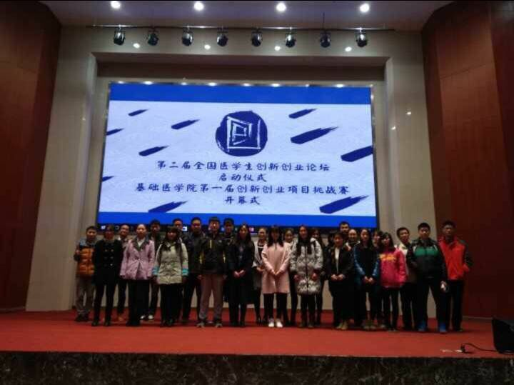

## The Opening Ceremony of the Second National Medical Student Innovation and Entrepreneurship Forum
{style="text-align: justify;"}
**As the principal organizer and leader** of the opening ceremony, I spearheaded the planning, organization, PPT creation, and stage management of the event. Prior to the opening ceremony, I devised a comprehensive event plan, including contingency measures for unexpected situations, and organized on-site inspections of the venue. During the opening ceremony, my responsibilities encompassed overall coordination and on-site management.  
{style="text-align: justify;"}
