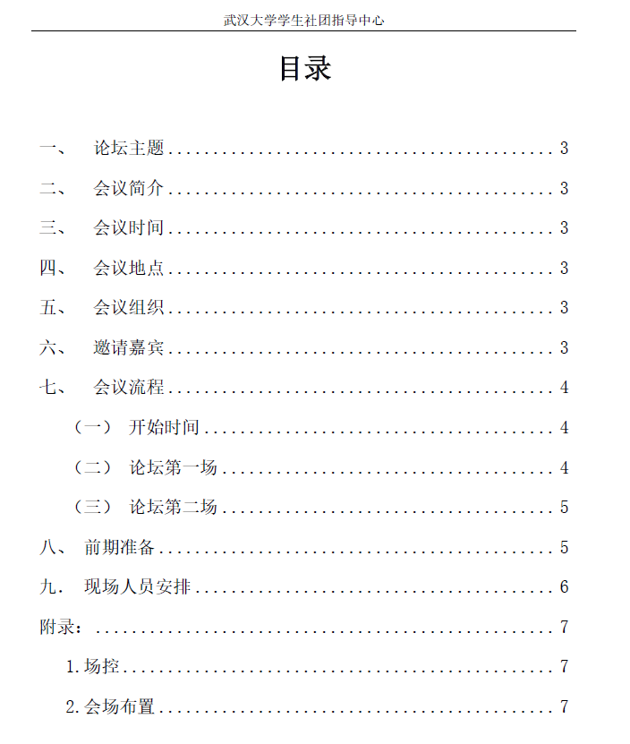
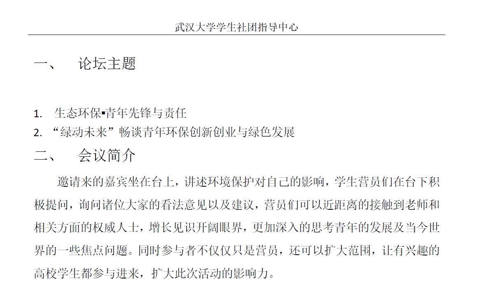
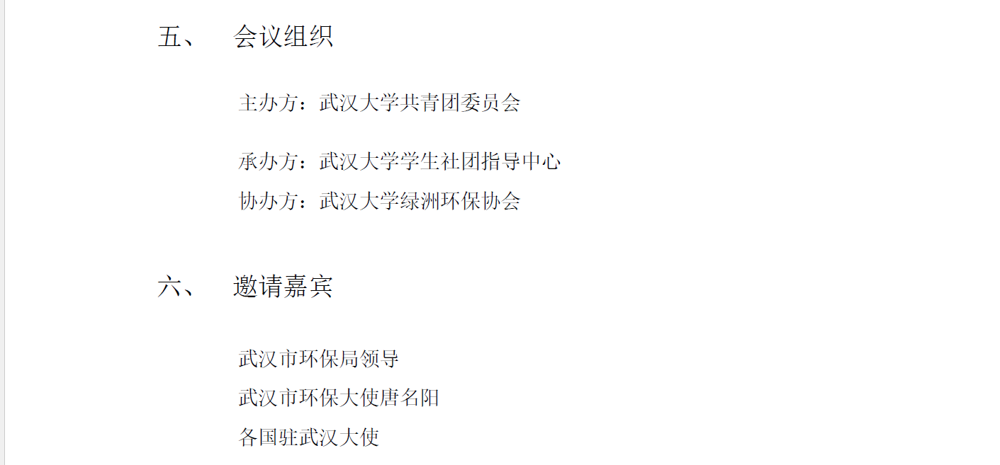

## Top Ten Student Organizations Selection Evening

**Participated in the organization** of the 2015-2016 Wuhan University Top Ten Student Organizations Selection Evening. **Main responsibilities included** coordinating and liaising with various student organizations, collecting materials they needed to showcase during the event, creating the procedural PowerPoint presentation, managing the playback of presentation materials and procedural PPTs during the event, and handling any unforeseen situations.  
{style="text-align: justify;"}

## 7th Student Organization International Exchange Camp

**Participated in event proposal drafting and personnel scheduling**, primarily responsible for coordinating and communicating with participants during the event, creating procedural PowerPoint presentations. **During the forum, the main responsibility** was overseeing the event flow and handling various unforeseen situations.  

