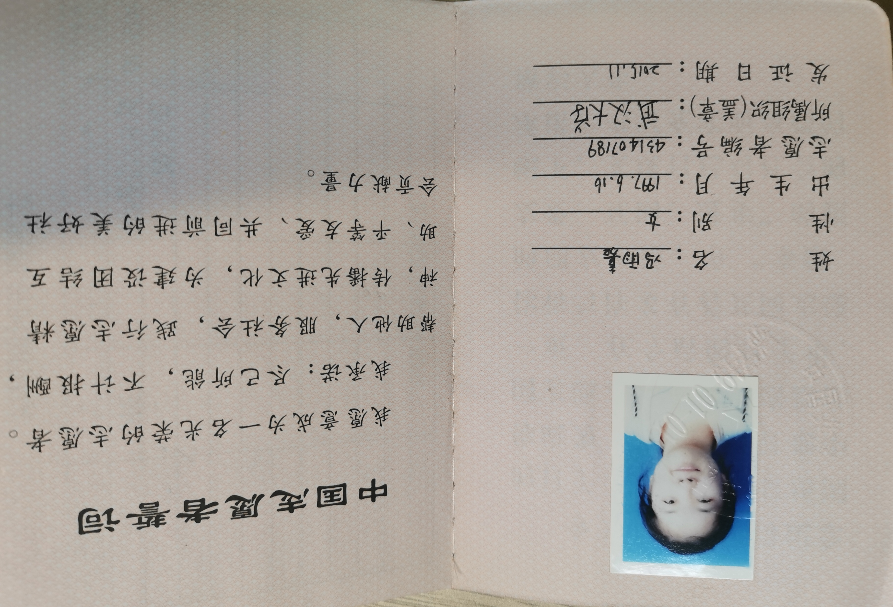

## Overview

1. On World Hypertension Day, my guidance instructors, fellow students, and I provided **free medical consultations, conducted blood pressure measurements, and offered medication guidance** to patients in need at the outpatient clinic.  
2. **We conducted promotional and educational activities** on hypertension, hyperlipidemia, and coronary heart disease for the elderly population in the community, while also offering complimentary consultations and assistance  
3. **Volunteering for altruistic blood donation for patients in need**  
{style="text-align: justify;"}

