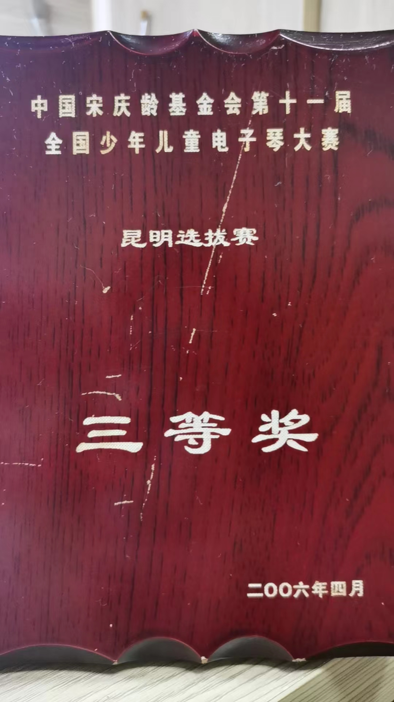

## Main Experience

I have achieved a **Grade 7 in electronic keyboard as an amateur player.**  I also received a Third Prize in the Kunming selection round of the 11th National Youth Electronic Keyboard Competition organized by the China Soong Ching Ling Foundation. During my third year of college, I had the opportunity to perform at the Farewell Gala of the School of Basic Medical Sciences.
{style="text-align: justify;"}

