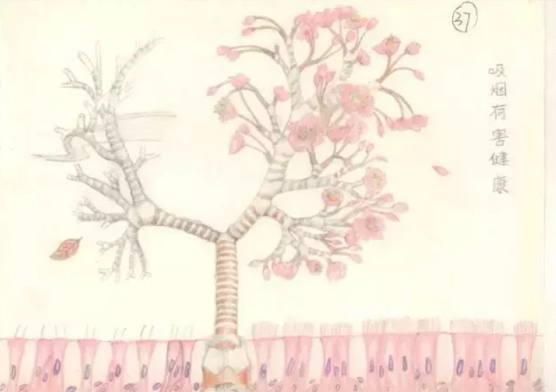
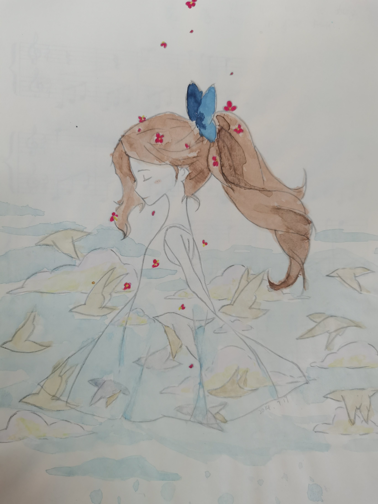
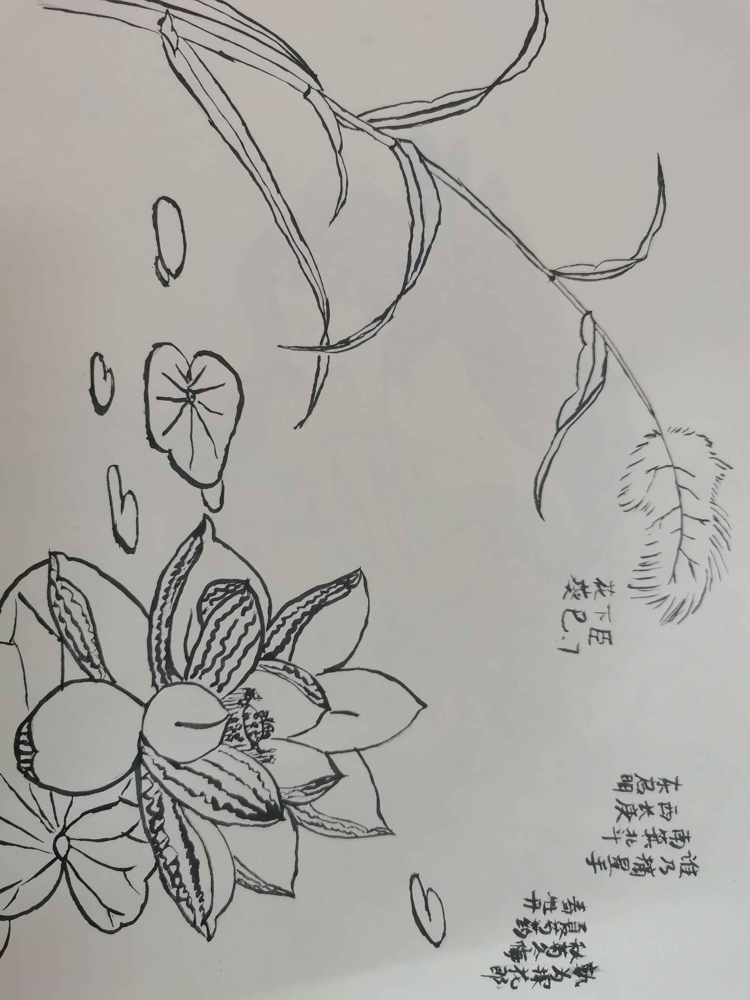
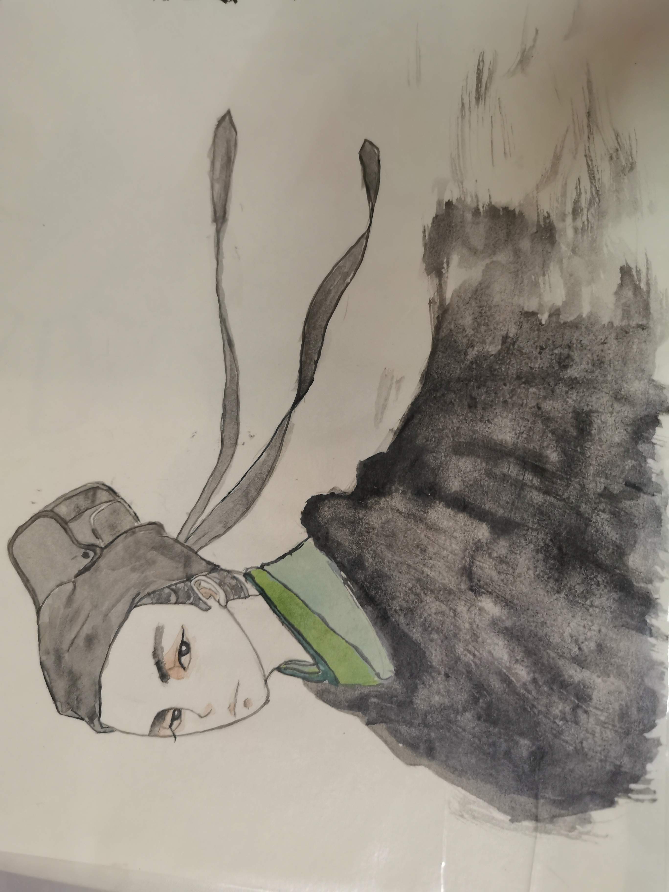

## Main Experience

I won the **first prize** in the 3rd Anatomy Illustration Competition held at Wuhan University School of Basic Medical Sciences.  
{style="text-align: justify;"}

I won the **second prize** in the 2nd Anatomy Illustration Competition held at Wuhan University School of Basic Medical Sciences.  
{style="text-align: justify;"}

## Showcasing amateur artwork in leisure time

