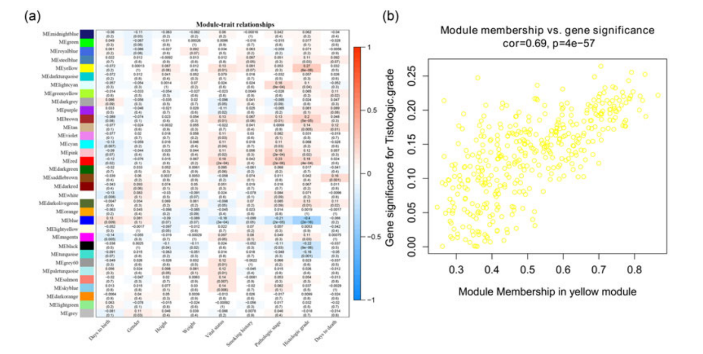
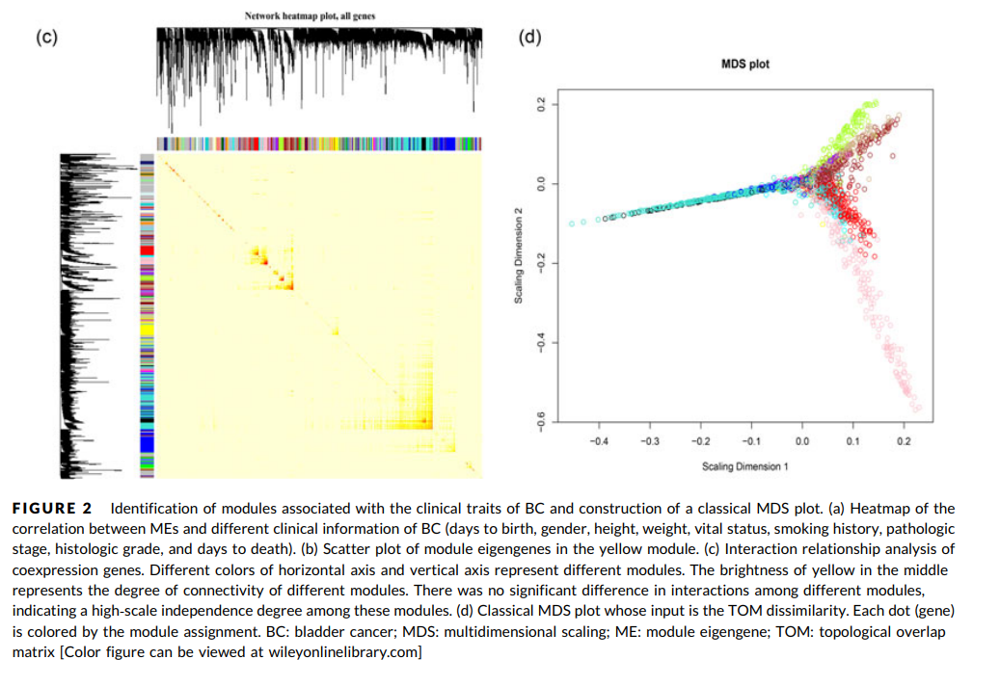
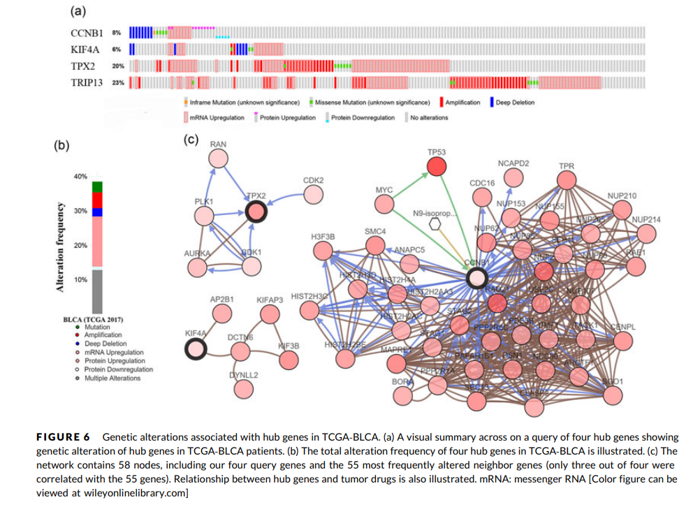

**Abstract**  
Bladder cancer (BC) is one of the most malignancies in terms of incidence and recurrence worldwide. The aim of this study is to find out novel and prognostic biomarkers for patients with BC. First, we identified 258 differentially expressed genes by using GSE19915 from Gene Expression Omnibus database. Second, a total of 33 modules were identified by constructing a coexpression network by using weighted gene coexpression network analysis and yellow module was regarded as the key module. Furthermore, by constructing protein-protein interaction networks, we preliminarily picked out 13 genes. Among them, four hub genes (CCNB1, KIF4A, TPX2, and TRIP13) were eventually identified by using five different methods (survival analysis, one-way analysis of variance, the Spearman correlation analysis, receiver operating characteristic curve, and expression value comparison), which were significantly correlated with the prognosis of BC. The validation of transcriptional and translational levels made sense (based on Oncomine and The Human Protein Atlas database). Moreover, functional enrichment analysis suggested that all the hub genes played crucial roles in chromosome segregation, sister chromatid segregation, nuclear chromosome segregation, mitotic nuclear division, nuclear division, and organelle fission during cell mitosis. In addition, three of the hub genes (KIF4A, TPX2, and TRIP13) might be potential targets of cancer drugs according to the results of the genetical alteration. In conclusion, this study indicates that four hub genes have great predictive value for the prognosis of BC, and may contribute to the exploration of the further and more in-depth research of BC.  
{style = "text-align: justify;"}

{}
Click the _Cite_ button above to import the reference into the reference management software.
{}
